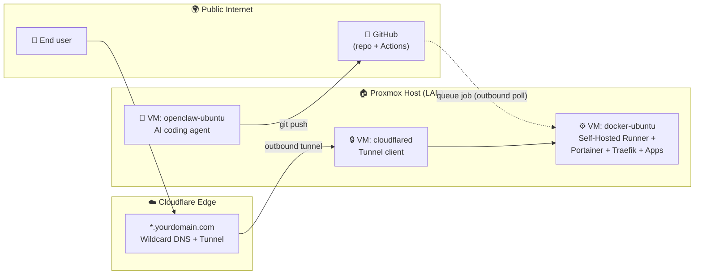
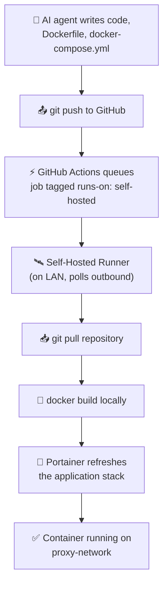
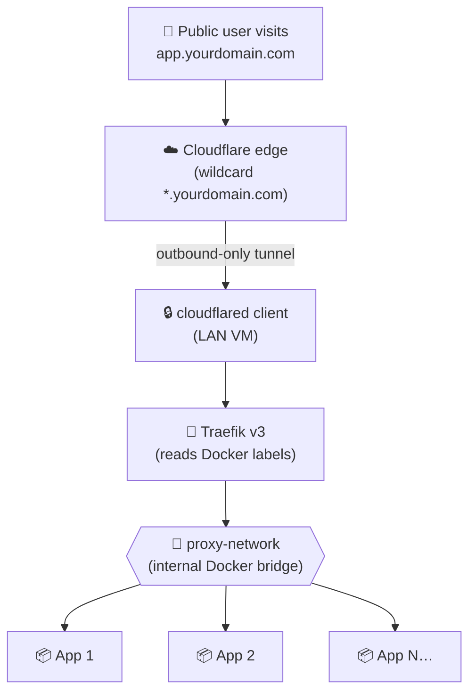

# 🏠 Homelab Pipeline

> A self-hosted, zero-trust CI/CD and ingress pipeline for AI-generated apps — from `git push` to a public URL, without ever opening a port on your router.

Welcome! 👋 This repository is the central documentation and configuration hub for a homelab platform that automatically builds, deploys, and publishes containerised apps generated by an AI coding agent. It is designed to be **safe enough to run from a residential network** and **simple enough to onboard a new app in under five minutes**.

If you are new to homelabbing, reverse proxies, or self-hosted CI/CD, don't worry — this README is written to walk you through it step by step.

---

## 📖 Table of Contents

1. [What is this project?](#-what-is-this-project)
2. [Architecture at a glance](#%EF%B8%8F-architecture-at-a-glance)
3. [The two pipelines](#-the-two-pipelines)
   - [CI/CD pipeline (code → container)](#1-cicd-pipeline-code--container)
   - [Traffic pipeline (internet → container)](#2-traffic-pipeline-internet--container)
4. [Infrastructure & tools](#%EF%B8%8F-infrastructure--tools)
5. [Repository structure](#-repository-structure)
6. [Getting started](#-getting-started)
7. [Adding a new app](#-adding-a-new-app)
8. [Security & zero-trust rationale](#-security--zero-trust-rationale)
9. [Troubleshooting](#%EF%B8%8F-troubleshooting)
10. [Glossary](#-glossary)

---

## 🎯 What is this project?

This is a **fully automated homelab deployment pipeline** with two halves:

| Half | Purpose | Tools |
|------|---------|-------|
| **CI/CD pipeline** | Turns code commits into running Docker containers, with no manual `ssh` or `docker build` steps. | GitHub Actions, Self-Hosted Runner, Portainer |
| **Traffic pipeline** | Exposes those containers to the public internet **without opening any inbound ports**, using a Cloudflare Tunnel and a Traefik reverse proxy. | Cloudflare Zero Trust, `cloudflared`, Traefik v3 |

The whole thing runs on a single Proxmox host split into purpose-built VMs, so each component is isolated and easy to rebuild.

### Why does this exist?

- ✅ **Hands-off deployment** — an AI coding agent can ship working software end-to-end.
- ✅ **No port forwarding** — your home router stays closed; Cloudflare brokers all inbound traffic.
- ✅ **Subfolder routing** — every app gets a clean URL like `yourdomain.com/myapp` without DNS changes.
- ✅ **Reproducible** — everything is defined in compose files and runner workflows; rebuilding a VM is a checklist, not a memory test.

---

## 🗺️ Architecture at a glance



**Key idea:** all arrows entering the homelab are **outbound-initiated** by the homelab itself. The router never sees an inbound connection request.

---

## 🔀 The two pipelines

### 1. CI/CD pipeline (code → container)



**How it works (plain English):**

1. The AI agent commits application code, a `Dockerfile`, and a `docker-compose.yml` to this repo.
2. GitHub Actions sees the new commit and queues a deployment job tagged `runs-on: self-hosted`.
3. A local **GitHub Self-Hosted Runner** sitting on the LAN polls GitHub *outbound* for jobs. Because the poll is outbound, no inbound firewall rule is needed.
4. The runner pulls the latest code and runs `docker build` locally — your code never has to leave the homelab to be built.
5. The runner talks to **Portainer** (via its local API/webhook or the Docker socket) to update or recreate the application stack.
6. Done — the new container is running on the shared `proxy-network` bridge, ready for Traefik to discover it.

### 2. Traffic pipeline (internet → container)



**How it works:**

1. A user hits `app.yourdomain.com` (or `yourdomain.com/myapp` for subfolder routing). Cloudflare intercepts at the edge.
2. The request travels down an **outbound-only Cloudflare Tunnel** to the `cloudflared` agent running on the Proxmox host.
3. `cloudflared` forwards the request to **Traefik** (the reverse proxy).
4. Traefik reads the `Host` header and **Docker container labels** to figure out where to send the request.
5. The traffic is delivered to the right container — entirely inside the isolated `proxy-network` Docker bridge.

> 📘 The full Traefik + Portainer setup, including the automated subfolder-routing trick, lives in [TraefikPortainerSetupGuide.md](TraefikPortainerSetupGuide.md).

---

## 🛠️ Infrastructure & tools

| Layer | Tool | What it does here | Why we chose it |
|-------|------|-------------------|-----------------|
| Virtualisation | **Proxmox VE** | Hosts segmented VMs (`openclaw-ubuntu`, `docker-ubuntu`, `cloudflared`). | Free, KVM-based, mature snapshots/backups. |
| AI agent | **AI coding agent** (running on a dedicated VM) | Writes app code, Dockerfiles, compose files, and commits them. | Isolated from production containers; can be torn down without risk. |
| Source control | **GitHub** | Public/private repo of record. | Free Actions minutes for self-hosted runners. |
| CI | **GitHub Actions** | Triggers deployment jobs on push/tag. | Tight integration with GitHub; supports self-hosted runners. |
| Build server | **GitHub Self-Hosted Runner** | Pulls code and builds Docker images on the LAN. | Keeps source/build artefacts on-prem; outbound-only. |
| Container engine | **Docker** | Runs every application as a container. | Industry standard; works seamlessly with compose + Portainer. |
| Container UI | **Portainer CE** | Manages stacks, networks, volumes through a web UI. | One-click stack redeploys; great for ops while learning. |
| Reverse proxy | **Traefik v3** | Routes HTTP traffic to containers by labels; strips path prefixes. | Auto-discovers containers — no per-app proxy config to maintain. |
| Network security | **Cloudflare Zero Trust** + `cloudflared` | Outbound-only tunnel from LAN to Cloudflare edge. | No port forwarding, free TLS, DDoS protection, optional Access policies. |

### VM responsibilities

| VM | Network | Role | Inbound ports needed |
|----|---------|------|----------------------|
| `openclaw-ubuntu` | LAN only | Runs the AI coding agent. | None (uses SSH + git outbound) |
| `docker-ubuntu` | LAN only | Hosts Docker, Portainer, Traefik, all app containers, and the GitHub runner. | `:80` from `cloudflared` only; `:9443` Portainer & `:8080` Traefik dashboard on LAN |
| `cloudflared` | LAN only | Runs the tunnel client. | None — all traffic is outbound to Cloudflare |

---

## 📂 Repository structure

```
homelabpipeline/
├── README.md                       ← You are here
├── TraefikPortainerSetupGuide.md   ← Step-by-step Traefik + Portainer setup
└── (future: workflows/, stacks/, ansible/, etc.)
```

> 💡 As the project grows, app stacks and GitHub workflow files will live alongside this README. Keep the root directory navigable — one folder per concern.

---

## 🚀 Getting started

This is a homelab project, so "getting started" means **building out the infrastructure**, not `npm install`. Plan for a few evenings.

### Prerequisites

- A machine capable of running Proxmox VE (or any hypervisor / spare Ubuntu host).
- A registered domain on **Cloudflare** (free plan is enough).
- A GitHub account.
- Basic comfort with the Linux command line.

### High-level setup order

1. **Provision Proxmox** and create three Ubuntu VMs: `docker-ubuntu`, `openclaw-ubuntu`, `cloudflared`. Give `docker-ubuntu` the most resources — that's where your apps live.
2. **Install Docker** on `docker-ubuntu` (`curl -fsSL https://get.docker.com | sh`).
3. **Set up the Cloudflare Tunnel** on the `cloudflared` VM:
   - Create a tunnel in the Cloudflare dashboard.
   - Add a public hostname `*.yourdomain.com` → `http://<docker-ubuntu-ip>:80`.
   - Run the `cloudflared` daemon with the provided token.
4. **Deploy Portainer + Traefik** following [TraefikPortainerSetupGuide.md](TraefikPortainerSetupGuide.md). Don't skip the `proxy-network` bridge creation step — it's the glue.
5. **Register the GitHub Self-Hosted Runner** on `docker-ubuntu`:
   - GitHub repo → Settings → Actions → Runners → New self-hosted runner.
   - Follow the displayed shell commands; install it as a service (`./svc.sh install && ./svc.sh start`).
6. **Add your first app** — see the next section.

> ⏱️ Tip: take a Proxmox snapshot before each major step. If something breaks, you can roll back in seconds.

---

## ➕ Adding a new app

The 80% case is delightfully simple:

1. Push a new `docker-compose.yml` to this repo for your app (see [TraefikPortainerSetupGuide.md](TraefikPortainerSetupGuide.md) Step 4 for the label scheme).
2. Add a GitHub Actions workflow (or extend the existing one) that:
   - Runs `on: push` for the relevant path.
   - Uses `runs-on: self-hosted`.
   - Calls `docker compose up -d --build` in the app's directory **or** hits the Portainer webhook for that stack.
3. Wait for the runner to pick up the job.
4. Visit `https://yourdomain.com/<service-name>` — Traefik will route automatically using the `defaultRule` that maps the compose **service name** to the URL path prefix.

**Minimum Docker labels** for a new app:

```yaml
labels:
  - "traefik.enable=true"
  - "traefik.http.routers.<service-name>.middlewares=auto-strip-prefix@file"
  - "traefik.http.services.<service-name>.loadbalancer.server.port=<container-port>"
```

That's it. No DNS changes, no Cloudflare changes, no Traefik config edits.

---

## 🔐 Security & zero-trust rationale

### What "zero-trust ingress" means here

Traditional homelab setups punch a hole in the home router (port-forward `80/443` → your server). That works, but it exposes your server's IP to the whole internet, and any vulnerability in your stack becomes an internet-facing vulnerability.

This project uses a **zero-trust ingress** model instead:

- 🚫 **No inbound ports** are opened on the router or any VM.
- 📡 **`cloudflared`** establishes an *outbound* persistent connection to Cloudflare's edge. Cloudflare proxies user requests *down* this existing tunnel — like a long-lived server-side WebSocket.
- 🛡️ The home IP is **never published** in DNS.
- 🔐 TLS is terminated at Cloudflare's edge with free, auto-rotated certificates.
- 🧱 You can optionally enable **Cloudflare Access** for an extra OAuth / Google / email-OTP gate before any request reaches Traefik.

### Network isolation inside the homelab

- All app containers and Traefik share a dedicated `proxy-network` Docker bridge — they can only talk to each other through Traefik.
- The Docker socket is mounted **read-only** into Traefik (`/var/run/docker.sock:/var/run/docker.sock:ro`) so a compromised Traefik can read labels but cannot create containers.
- Portainer's web UI (`:9443`) and the Traefik dashboard (`:8080`) are **LAN-only** — never exposed via the tunnel.

### Things to keep in mind

- 🔑 **Rotate the runner token** if you ever rebuild `docker-ubuntu`.
- 🪪 **Treat the Cloudflare Tunnel credentials file as a secret** — it's effectively a key to your homelab.
- 🧯 **Don't expose the Docker socket** to app containers. Only Traefik and Portainer should ever see it.
- 🆙 **Pin or auto-update images** — `traefik:latest` is convenient, but for production you may prefer a pinned minor version.
- 🚷 **Never commit real domains, tokens, or credentials.** Use `yourdomain.com` as a placeholder and load real values from environment variables or a `.env` file that is `.gitignore`'d.

---

## 🛠️ Troubleshooting

| Symptom | First thing to check |
|---------|----------------------|
| 🚫 `404 page not found` from Traefik | Open `http://<docker-ubuntu>:8080/dashboard/` on the LAN. If your router isn't listed, the labels are wrong or the container isn't on `proxy-network`. |
| 🔌 Traefik logs say `client version is too old` | Update the Traefik image to `traefik:latest` (or v3.6+). |
| ❌ Runner shows `offline` in GitHub | SSH into `docker-ubuntu`, check `sudo systemctl status actions.runner.*`. Restart if dead. |
| 🌐 Cloudflare returns `Error 1033` / `530` | The `cloudflared` daemon isn't running or can't reach `docker-ubuntu:80`. Check `journalctl -u cloudflared -f`. |
| 🔁 Stack redeploys but URL still 404s | Confirm the compose **service name** matches the `traefik.http.routers.<name>` label, and that the container is on `proxy-network` (not the default stack network). |
| 🔑 `permission denied` on `/var/run/docker.sock` | Container needs to be in the `docker` group on the host, or mount the socket explicitly. |
| 🐢 Build runs but is very slow | Check disk space on `docker-ubuntu` (`df -h`). Old image layers fill up `/var/lib/docker` fast — prune with `docker system prune -af` when safe. |

> 📘 For a deeper Traefik-specific checklist, see the **Troubleshooting Checklist** at the bottom of [TraefikPortainerSetupGuide.md](TraefikPortainerSetupGuide.md).

---

## 📚 Glossary

- **Reverse proxy** — a server that accepts incoming requests and forwards them to the right backend (here: Traefik).
- **Stack** — a Portainer term for one or more containers managed together via a `docker-compose.yml`.
- **Self-hosted runner** — a GitHub Actions worker that runs on *your* hardware instead of in GitHub's cloud.
- **Cloudflare Tunnel** — an outbound-only persistent connection from your network to Cloudflare's edge, replacing port forwarding.
- **Zero-trust** — a security model where no network location is implicitly trusted; every request is authenticated/authorised.
- **`proxy-network`** — the named Docker bridge network that connects Traefik to all app containers.

---

## 🤝 Contributing

This is currently a personal homelab project, but if you find a typo, a smarter Traefik label, or a security improvement, PRs are welcome. Please:

1. Keep secrets and real domains out of commits (the included setup uses `yourdomain.com` as a placeholder for a reason 😉).
2. Test changes on a snapshot / throwaway VM before opening a PR.
3. Update both the README and the corresponding `*SetupGuide.md` when behaviour changes.

---

## 📝 License

TBD — add a `LICENSE` file (MIT or Apache-2.0 are common picks for infra-docs repos).
