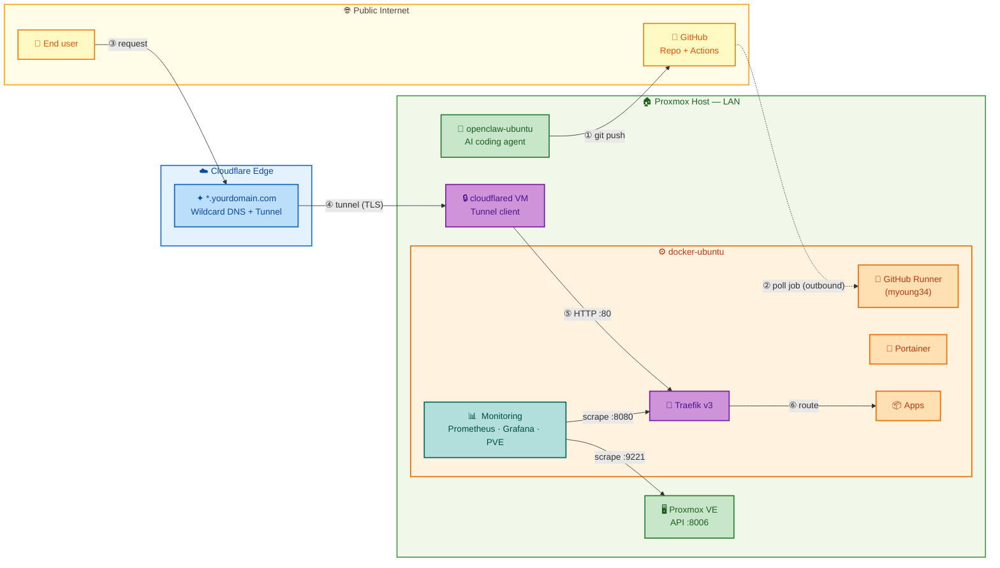
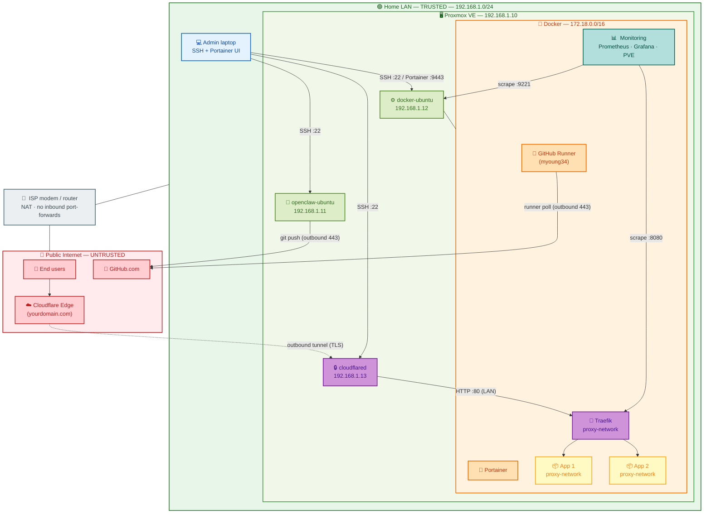
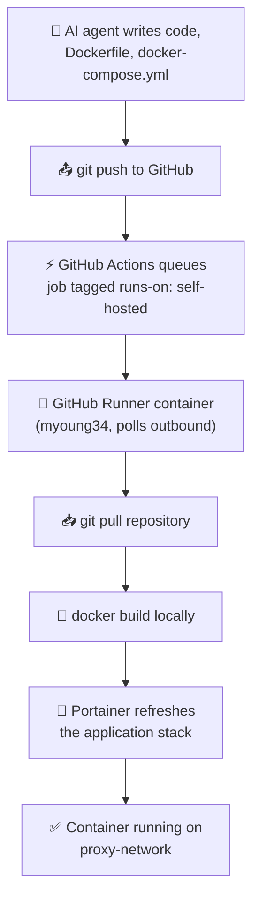
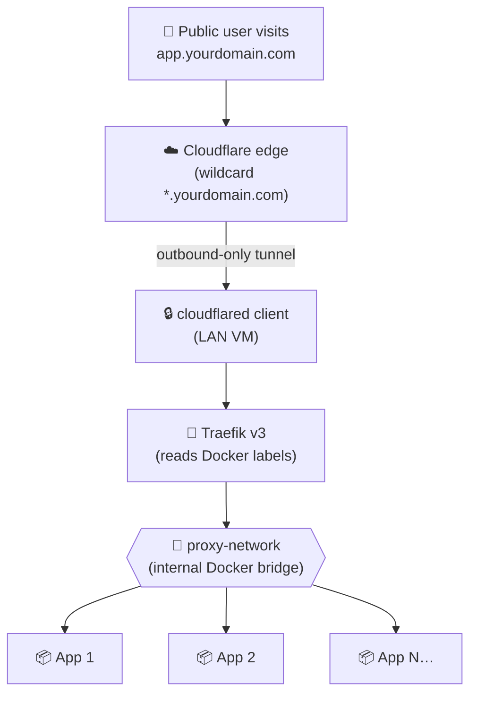

# 🏠 Homelab Pipeline

> A self-hosted, zero-trust CI/CD and ingress pipeline for AI-generated apps — from `git push` to a public URL, without ever opening a port on your router.

Welcome! 👋 This repository is the central documentation and configuration hub for a homelab platform that automatically builds, deploys, and publishes containerised apps generated by an AI coding agent. It is designed to be **safe enough to run from a residential network** and **simple enough to onboard a new app in under five minutes**.

If you are new to homelabbing, reverse proxies, or self-hosted CI/CD, don't worry — this README is written to walk you through it step by step.

---

## 📖 Table of Contents

1. [What is this project?](#-what-is-this-project)
2. [Architecture at a glance](#%EF%B8%8F-architecture-at-a-glance)
3. [Home-network topology](#-home-network-topology)
4. [The two pipelines](#-the-two-pipelines)
   - [CI/CD pipeline (code → container)](#1-cicd-pipeline-code--container)
   - [Traffic pipeline (internet → container)](#2-traffic-pipeline-internet--container)
5. [Infrastructure & tools](#%EF%B8%8F-infrastructure--tools)
6. [Port usage](#-port-usage)
7. [Repository structure](#-repository-structure)
8. [Getting started](#-getting-started)
9. [Setup guides](#-setup-guides)
10. [Adding a new app](#-adding-a-new-app)
11. [Monitoring](#-monitoring)
12. [Security & zero-trust rationale](#-security--zero-trust-rationale)
13. [Troubleshooting](#%EF%B8%8F-troubleshooting)
14. [Glossary](#-glossary)

---

## 🎯 What is this project?

This is a **fully automated homelab deployment pipeline** with two halves:

| Half | Purpose | Tools |
|------|---------|-------|
| **CI/CD pipeline** | Turns code commits into running Docker containers, with no manual `ssh` or `docker build` steps. | GitHub Actions, Runner (myoung34), Portainer |
| **Traffic pipeline** | Exposes those containers to the public internet **without opening any inbound ports**, using a Cloudflare Tunnel and a Traefik reverse proxy. | Cloudflare Zero Trust, `cloudflared`, Traefik v3 |
| **Monitoring stack** | Collects and visualises metrics from Proxmox, Traefik, and Docker — LAN-only, never exposed to the internet. | Prometheus, Grafana, PVE Exporter |

The whole thing runs on a single Proxmox host split into purpose-built VMs, so each component is isolated and easy to rebuild.

### Why does this exist?

- ✅ **Hands-off deployment** — an AI coding agent can ship working software end-to-end.
- ✅ **No port forwarding** — your home router stays closed; Cloudflare brokers all inbound traffic.
- ✅ **Subfolder routing** — every app gets a clean URL like `yourdomain.com/myapp` without DNS changes.
- ✅ **Reproducible** — everything is defined in compose files and runner workflows; rebuilding a VM is a checklist, not a memory test.

---

## 🗺️ Architecture at a glance



> **Color key:** 🟡 Public internet · 🔵 Cloudflare · 🟢 Proxmox/infra · 🟠 Docker services · 🟣 Gateways (Traefik, cloudflared) · 🟢 Monitoring

**Key idea:** all arrows entering the homelab are **outbound-initiated** by the homelab itself. The router never sees an inbound connection request.

---

## 🏘️ Home-network topology

This diagram shows the **logical** layout of the home network — devices, subnets, and the trust boundaries between them. Solid lines are normal LAN traffic; the dashed line is the one outbound-only connection that links the homelab to the public internet.



> **Color key:** 🔴 Untrusted zone · 🟢 Trusted LAN · 🟣 Gateways (Traefik, cloudflared) · 🟠 Docker services · 🟡 Apps · 🔵 Admin · ⚪ ISP boundary

### Trust boundaries

| Boundary | Direction | Notes |
|----------|-----------|-------|
| Internet ↔ ISP router | Inbound **denied** | No port-forwards. ISP NAT acts as a basic firewall. |
| Cloudflare ↔ `cloudflared` VM | Outbound **only** (initiated by `cloudflared`) | The tunnel is the *only* path from the public internet into the homelab. |
| `cloudflared` ↔ `docker-ubuntu` | LAN, port 80 | Plain HTTP is fine here — TLS is terminated at Cloudflare and the LAN is trusted. |
| `docker-ubuntu` ↔ `proxy-network` | Docker bridge | Containers talk to each other only through this bridge. |
| `docker-ubuntu` ↔ Proxmox API | LAN, port 8006 | PVE Exporter scrapes Proxmox metrics over the LAN. Token-based auth only. |
| Monitoring containers ↔ `docker-ubuntu` | Docker bridge | Prometheus scrapes Traefik (`:8080`) and PVE Exporter (`:9221`) internally. |
| Admin laptop ↔ VMs | LAN, port 22 / 9443 | SSH key auth; management UIs are LAN-only. |

---

## 🔀 The two pipelines

### 1. CI/CD pipeline (code → container)



**How it works:**

1. The AI agent commits application code, a `Dockerfile`, and a `docker-compose.yml` to this repo.
2. GitHub Actions sees the new commit and queues a deployment job tagged `runs-on: self-hosted`.
3. A **GitHub Runner container** (based on `myoung34/github-runner`) on the LAN polls GitHub *outbound* for jobs. Because the poll is outbound, no inbound firewall rule is needed.
4. The runner pulls the latest code and runs `docker build` locally — your code never has to leave the homelab to be built.
5. The runner talks to **Portainer** (via its local API) to update or recreate the application stack.
6. Done — the new container is running on the shared `proxy-network` bridge, ready for Traefik to discover it.

### 2. Traffic pipeline (internet → container)



**How it works:**

1. A user hits `app.yourdomain.com` (or `yourdomain.com/myapp` for subfolder routing). Cloudflare intercepts at the edge.
2. The request travels down an **outbound-only Cloudflare Tunnel** to the `cloudflared` agent running on the Proxmox host.
3. `cloudflared` forwards the request to **Traefik** (the reverse proxy).
4. Traefik reads the `Host` header and **Docker container labels** to figure out where to send the request.
5. The traffic is delivered to the right container — entirely inside the isolated `proxy-network` Docker bridge.

> 📘 The full Traefik + Portainer setup, including the automated subfolder-routing trick, lives in [TraefikPortainerSetupGuide.md](TraefikPortainerSetupGuide.md).

---

## 🛠️ Infrastructure & tools

| Layer | Tool | What it does here | Why we chose it |
|-------|------|-------------------|-----------------|
| Virtualisation | **Proxmox VE** | Hosts segmented VMs (`openclaw-ubuntu`, `docker-ubuntu`, `cloudflared`). | Free, KVM-based, mature snapshots/backups. |
| AI agent | **AI coding agent** (running on a dedicated VM) | Writes app code, Dockerfiles, compose files, and commits them. | Isolated from production containers; can be torn down without risk. |
| Source control | **GitHub** | Public/private repo of record. | Free Actions minutes for self-hosted runners. |
| CI | **GitHub Actions** | Triggers deployment jobs on push/tag. | Tight integration with GitHub; supports self-hosted runners. |
| Build server | **GitHub Runner** (myoung34) | Pulls code and builds Docker images on the LAN. Runs as a Docker container with Docker socket access. | Keeps source/build artefacts on-prem; outbound-only; container-native. |
| Container engine | **Docker** | Runs every application as a container. | Industry standard; works seamlessly with compose + Portainer. |
| Container UI | **Portainer CE** | Manages stacks, networks, volumes through a web UI. | One-click stack redeploys; great for ops while learning. |
| Reverse proxy | **Traefik v3** | Routes HTTP traffic to containers by labels; strips path prefixes. | Auto-discovers containers — no per-app proxy config to maintain. |
| Network security | **Cloudflare Zero Trust** + `cloudflared` | Outbound-only tunnel from LAN to Cloudflare edge. | No port forwarding, free TLS, DDoS protection, optional Access policies. |
| Monitoring | **Prometheus + Grafana** | Prometheus scrapes metrics; Grafana visualises them on dashboards. PVE Exporter translates the Proxmox API for Prometheus. | LAN-only; all three containers have `traefik.enable=false`. |

### VM responsibilities

| VM | Network | Role | Inbound ports needed |
|----|---------|------|----------------------|
| `openclaw-ubuntu` | LAN only | Runs the AI coding agent. | None (uses SSH + git outbound) |
| `docker-ubuntu` | LAN only | Hosts Docker, Portainer, Traefik, monitoring (Prometheus/Grafana/PVE Exporter), all app containers, and the GitHub Runner container. | `:80` from `cloudflared` only; `:9443` Portainer, `:8080` Traefik, `:9090` Prometheus, `:3030` Grafana on LAN |
| `cloudflared` | LAN only | Runs the tunnel client. | None — all traffic is outbound to Cloudflare |

---

## 🔌 Port usage

A single source of truth for every port that listens anywhere in the homelab. Anything not listed here should **not** be open.

| Port | Proto | Host / Container | Service | Reachable from | Notes |
|------|-------|------------------|---------|----------------|-------|
| `22` | TCP | All VMs | OpenSSH | LAN only | Key-based auth only; disable password auth. |
| `80` | TCP | `docker-ubuntu` → Traefik container | HTTP ingress | `cloudflared` (LAN) | Plain HTTP; TLS is terminated at Cloudflare's edge. |
| `443` | TCP | — | *(not used)* | — | No HTTPS listener inside the LAN; Cloudflare handles TLS. |
| `8080` | TCP | Traefik container | Traefik dashboard / API | LAN only | `--api.insecure=true`; never expose via the tunnel. |
| `9443` | TCP | `docker-ubuntu` → Portainer container | Portainer Web UI (HTTPS) | LAN only | Self-signed cert; access via `https://<docker-ubuntu>:9443`. |
| `8000` | TCP | `docker-ubuntu` → Portainer container | Portainer Edge agent tunnel | LAN only | Optional; only needed if you use Edge agents. |
| `8081+` | TCP | `docker-ubuntu` → app containers | Per-app LAN bypass | LAN only (optional) | Handy for local testing/safety net; not required for the public flow. |
| `9090` | TCP | `docker-ubuntu` → Prometheus container | Prometheus Web UI | LAN only | Metrics browser; not exposed via tunnel. |
| `3030` | TCP | `docker-ubuntu` → Grafana container | Grafana Dashboards | LAN only | Mapped from container 3000; not exposed via tunnel. |
| `9221` | TCP | `docker-ubuntu` → PVE Exporter container | Proxmox metrics endpoint | Docker internal only | Scraped by Prometheus over `proxy-network`; no host port mapping needed. |
| `*/443` | TCP | `cloudflared` VM → Cloudflare | Outbound tunnel | Outbound to internet | The only sustained connection leaving the homelab to the public internet. |
| `*/443` | TCP | GitHub Runner container → GitHub | Job polling | Outbound to internet | HTTPS poll; no inbound rule needed. |

> 🛡️ Rule of thumb: if a port shows **"Reachable from: LAN only"**, make sure your router's firewall (or `ufw` on the VM) drops that port from the WAN side, and never add a Cloudflare public hostname pointing at it.

---

## �📂 Repository structure

```
homelabpipeline/
├── README.md                            ← You are here
├── deployment-guide.md                   ← Vite/SPA multi-environment base-path guide
├── ProxmoxVMSetupGuide.md               ← Provision the three Ubuntu VMs on Proxmox
├── DockerInstallSetupGuide.md           ← Install Docker + create the proxy-network
├── TraefikPortainerSetupGuide.md        ← Deploy Portainer + Traefik (auto subfolder routing)
├── CloudflareTunnelSetupGuide.md        ← Create the Cloudflare Tunnel + cloudflared
├── GitHubRunnerSetupGuide.md            ← Register the self-hosted GitHub runner
├── .github/
│   └── workflows/
│       └── deploy.yml                   ← Deploys infra stacks from stacks/ on push to main
├── templates/
│   └── homelabdeploy.yml                ← Copy into APP REPOS for zero-touch Portainer deployment
└── stacks/
    ├── traefik/
    │   ├── docker-compose.yml           ← Traefik v3 stack (subfolder routing)
    │   └── config/dynamic.yml           ← File-provider middlewares
    ├── portainer/
    │   └── docker-compose.yml           ← Portainer CE stack
    ├── example-app/
    │   └── docker-compose.yml           ← Subfolder routing variant (yourdomain.com/example-app)
    ├── example-app-host/
    │   └── docker-compose.yml           ← Per-host routing variant (app.yourdomain.com)
    ├── github-runner/
    │   └── docker-compose.yml           ← myoung34 GitHub Actions runner (Docker-based)
    └── monitoring/
        ├── docker-compose.yml           ← Prometheus + Grafana + PVE Exporter
        └── config/
            ├── prometheus.yml           ← Prometheus scrape targets
            └── pve.yml                  ← Proxmox API token config (template)
```

> 💡 Keep the root directory navigable — one folder per concern, one guide per major component.

---

## 🚀 Getting started

This is a homelab project, so "getting started" means **building out the infrastructure**, not `npm install`. Plan for a few evenings.

### Prerequisites

- A machine capable of running Proxmox VE (or any hypervisor / spare Ubuntu host).
- A registered domain on **Cloudflare** (free plan is enough).
- A GitHub account.
- Basic comfort with the Linux command line.

### High-level setup order

Work through the setup guides in this order. Each one is self-contained and builds on the previous.

1. 🖥️ **[ProxmoxVMSetupGuide.md](ProxmoxVMSetupGuide.md)** — install Proxmox VE and provision the three Ubuntu VMs.
2. 🐳 **[DockerInstallSetupGuide.md](DockerInstallSetupGuide.md)** — install Docker on `docker-ubuntu` and create the shared `proxy-network` bridge.
3. 🚦 **[TraefikPortainerSetupGuide.md](TraefikPortainerSetupGuide.md)** — deploy Portainer and Traefik with automated subfolder routing.
4. 🔒 **[CloudflareTunnelSetupGuide.md](CloudflareTunnelSetupGuide.md)** — create the tunnel and run `cloudflared`.
5. ⚙️ **[GitHubRunnerSetupGuide.md](GitHubRunnerSetupGuide.md)** — deploy the myoung34 GitHub Runner as a Docker container.
6. ➕ **Add your first app** — see the next section.

> ⏱️ Tip: take a Proxmox snapshot before each major step. If something breaks, you can roll back in seconds.

---

## 📘 Setup guides

| # | Guide | Covers |
|---|-------|--------|
| 1 | [ProxmoxVMSetupGuide.md](ProxmoxVMSetupGuide.md) | Proxmox install, ISO upload, VM creation, networking, snapshots |
| 2 | [DockerInstallSetupGuide.md](DockerInstallSetupGuide.md) | Docker Engine + Compose plugin install, `proxy-network` bridge, non-root user |
| 3 | [TraefikPortainerSetupGuide.md](TraefikPortainerSetupGuide.md) | Portainer install, Traefik stack, dynamic middleware, subfolder routing |
| 4 | [CloudflareTunnelSetupGuide.md](CloudflareTunnelSetupGuide.md) | Cloudflare Zero Trust tunnel, wildcard hostname, `cloudflared` as a service |
| 5 | [GitHubRunnerSetupGuide.md](GitHubRunnerSetupGuide.md) | myoung34 Docker-based runner deployment, token setup, Docker socket mounting |
| 6 | [deployment-guide.md](deployment-guide.md) | Vite/SPA base-path config for GitHub Pages + Traefik + direct IP access |

---

## ➕ Adding a new app

The 80% case is delightfully simple. Two routing patterns are supported:

### Subfolder routing (default) — `yourdomain.com/<service-name>`

Use this when the app is happy living under a path prefix. Copy [`stacks/example-app/docker-compose.yml`](stacks/example-app/docker-compose.yml) as your starting point.

### Per-host routing — `app.yourdomain.com`

Use this when an app generates absolute links to `/static/...`, hard-codes URLs, or you just prefer subdomains. Copy [`stacks/example-app-host/docker-compose.yml`](stacks/example-app-host/docker-compose.yml) instead.

### Either way

1. Push the new `docker-compose.yml` (and any source code) to this repo under `stacks/<your-app>/`.
2. The infra deploy workflow in [`.github/workflows/deploy.yml`](.github/workflows/deploy.yml) picks it up automatically on push to `main`.
3. For **app repos** (with their own Dockerfile), copy [`templates/homelabdeploy.yml`](templates/homelabdeploy.yml) into `.github/workflows/` in that repo.
4. Visit your new URL and confirm Traefik routes the request.

> **SPA apps:** If your app is a Vite/React SPA that needs to work behind a subfolder path, follow the [deployment guide](deployment-guide.md) to configure `base` path, nginx aliases, and Traefik labels correctly.

**Minimum Docker labels** for a subfolder-routed app:

```yaml
labels:
  - "traefik.enable=true"
  - "traefik.http.routers.<service-name>.middlewares=auto-strip-prefix@file"
  - "traefik.http.services.<service-name>.loadbalancer.server.port=<container-port>"
```

No DNS changes, no Cloudflare changes, no Traefik config edits.

---

## 📊 Monitoring

The homelab includes a **LAN-only monitoring stack** that collects and visualises metrics from Proxmox, Traefik, and Docker. It is **never exposed to the internet** — all three containers have `traefik.enable=false`.

### What's monitored

| Target | Port | Metrics collected |
|--------|------|-------------------|
| Proxmox VE | `:9221` (via PVE Exporter) | CPU, RAM, disk, VM status, network I/O per VM |
| Traefik | `:8080` (metrics endpoint) | Request count, latency, error rates per router/service |
| Prometheus (self) | `:9090` | Scrape health, rule evaluation, target discovery |

### Accessing dashboards

- **Grafana:** `http://<docker-ubuntu>:3030` (default login: `admin` / `admin`, change on first login)
- **Prometheus targets:** `http://<docker-ubuntu>:9090/targets`

Both are reachable only from the LAN — there is no Cloudflare Tunnel hostname pointing at them.

### Setup notes

1. Copy the config files from `stacks/monitoring/config/` to `/home/ubuntu/prometheus/` on the host.
2. Edit `pve.yml` with your Proxmox API token. **Important:** when creating the token in Proxmox, unchecking "Privilege Separation" is easiest. If you leave it checked, you **must** also add a Token Permission row at Datacenter → Permissions → Add → Token Permission targeting `user@pve!tokenid`.
3. Create the data directories: `mkdir -p /home/ubuntu/prometheus/data /home/ubuntu/grafana/data`.
4. Deploy the stack via Portainer or `docker compose up -d`.

### Known pitfalls

| Pitfall | Symptom | Fix |
|---------|----------|-----|
| Tab characters in `prometheus.yml` | `Error loading config: did not find expected key` | Replace all tabs with spaces. Run `echo "set tabstospaces" >> ~/.nanorc` to prevent this. |
| PVE token has Privilege Separation | `403 Forbidden` from PVE Exporter | Add a Token Permission row in Proxmox for `user@pve!tokenid`. |
| Port 3000 conflict | Grafana fails to start with bind error | Host port is mapped to `3030:3000` to avoid conflicts. Access on port 3030. |
| Docker DNS failure | `lookup prometheus on 127.0.0.11:53: server misbehaving` | The target container was in a crash loop. Fix the config and restart. |
| Grafana "no data" | Empty dashboards | Verify the data source URL is `http://prometheus:9090` (Docker DNS), not `localhost`. |

---

## 🔐 Security & zero-trust rationale

### What "zero-trust ingress" means here

Traditional homelab setups punch a hole in the home router (port-forward `80/443` → your server). That works, but it exposes your server's IP to the whole internet, and any vulnerability in your stack becomes an internet-facing vulnerability.

This project uses a **zero-trust ingress** model instead:

- 🚫 **No inbound ports** are opened on the router or any VM.
- 📡 **`cloudflared`** establishes an *outbound* persistent connection to Cloudflare's edge. Cloudflare proxies user requests *down* this existing tunnel — like a long-lived server-side WebSocket.
- 🛡️ The home IP is **never published** in DNS.
- 🔐 TLS is terminated at Cloudflare's edge with free, auto-rotated certificates.
- 🧱 You can optionally enable **Cloudflare Access** for an extra OAuth / Google / email-OTP gate before any request reaches Traefik.

### Network isolation inside the homelab

- All app containers and Traefik share a dedicated `proxy-network` Docker bridge — they can only talk to each other through Traefik.
- The Docker socket is mounted **read-only** into Traefik (`/var/run/docker.sock:/var/run/docker.sock:ro`) so a compromised Traefik can read labels but cannot create containers.
- Portainer's web UI (`:9443`), the Traefik dashboard (`:8080`), Grafana (`:3030`), and Prometheus (`:9090`) are **LAN-only** — never exposed via the tunnel.

### Things to keep in mind

- 🔑 **Rotate the runner token** if you ever rebuild `docker-ubuntu` or recreate the container.
- 🪪 **Treat the Cloudflare Tunnel credentials file as a secret** — it's effectively a key to your homelab.
- 🧯 **Don't expose the Docker socket** to app containers. Only Traefik and Portainer should ever see it.
- 🆙 **Pin or auto-update images** — `traefik:latest` is convenient, but for production you may prefer a pinned minor version.
- 🚷 **Never commit real domains, tokens, or credentials.** Use `yourdomain.com` as a placeholder and load real values from environment variables or a `.env` file that is `.gitignore`'d.

---

## 🛠️ Troubleshooting

| Symptom | First thing to check |
|---------|----------------------|
| 🚫 `404 page not found` from Traefik | Open `http://<docker-ubuntu>:8080/dashboard/` on the LAN. If your router isn't listed, the labels are wrong or the container isn't on `proxy-network`. |
| 🔌 Traefik logs say `client version is too old` | Update the Traefik image to `traefik:latest` (or v3.6+). |
| ❌ Runner shows `offline` in GitHub | `docker ps` on `docker-ubuntu` to check if the `github-runner` container is running. Restart with `docker compose up -d` from `stacks/github-runner/`. |
| 🌐 Cloudflare returns `Error 1033` / `530` | The `cloudflared` daemon isn't running or can't reach `docker-ubuntu:80`. Check `journalctl -u cloudflared -f`. |
| 🔁 Stack redeploys but URL still 404s | Confirm the compose **service name** matches the `traefik.http.routers.<name>` label, and that the container is on `proxy-network` (not the default stack network). |
| 🔑 `permission denied` on `/var/run/docker.sock` | Container needs to be in the `docker` group on the host, or mount the socket explicitly. |
| 🐢 Build runs but is very slow | Check disk space on `docker-ubuntu` (`df -h`). Old image layers fill up `/var/lib/docker` fast — prune with `docker system prune -af` when safe. |
| 📊 Prometheus target is **DOWN** | Check that the scrape target uses the Docker service name (e.g. `pve-exporter:9221`) not `localhost` inside the container. Verify `prometheus.yml` has no Tab characters (spaces only). |
| 🔑 PVE Exporter returns **403 Forbidden** | The Proxmox API token has Privilege Separation enabled. You must add a Token Permission row at Datacenter → Permissions targeting `user@pve!tokenid`. See `stacks/monitoring/config/pve.yml`. |
| 📈 Grafana shows **no data** | Confirm Grafana's data source points to `http://prometheus:9090` (Docker DNS, not `localhost`). Check that Prometheus targets are UP at `http://<docker-ubuntu>:9090/targets`. |

> 📘 For a deeper Traefik-specific checklist, see the **Troubleshooting Checklist** at the bottom of [TraefikPortainerSetupGuide.md](TraefikPortainerSetupGuide.md).

---

## 📚 Glossary

- **Reverse proxy** — a server that accepts incoming requests and forwards them to the right backend (here: Traefik).
- **Stack** — a Portainer term for one or more containers managed together via a `docker-compose.yml`.
- **Self-hosted runner** — a GitHub Actions worker that runs on *your* hardware instead of in GitHub's cloud. Here, it's a Docker container using the `myoung34/github-runner` image.
- **Cloudflare Tunnel** — an outbound-only persistent connection from your network to Cloudflare's edge, replacing port forwarding.
- **Zero-trust** — a security model where no network location is implicitly trusted; every request is authenticated/authorised.
- **`proxy-network`** — the named Docker bridge network that connects Traefik to all app containers.
- **PVE Exporter** — a Prometheus exporter that translates the Proxmox VE API into Prometheus-format metrics. Requires an API token with explicit Token Permission.

---

## 🤝 Contributing

This is currently a personal homelab project, but if you find a typo, a smarter Traefik label, or a security improvement, PRs are welcome. Please:

1. Keep secrets and real domains out of commits (the included setup uses `yourdomain.com` as a placeholder for a reason 😉).
2. Test changes on a snapshot / throwaway VM before opening a PR.
3. Update both the README and the corresponding `*SetupGuide.md` when behaviour changes.
